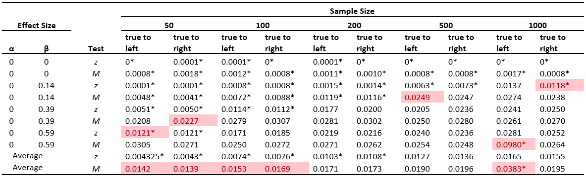
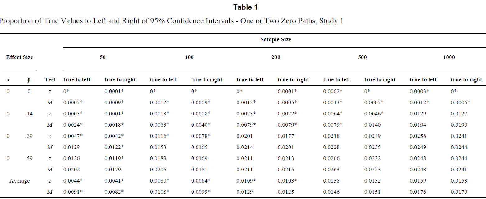
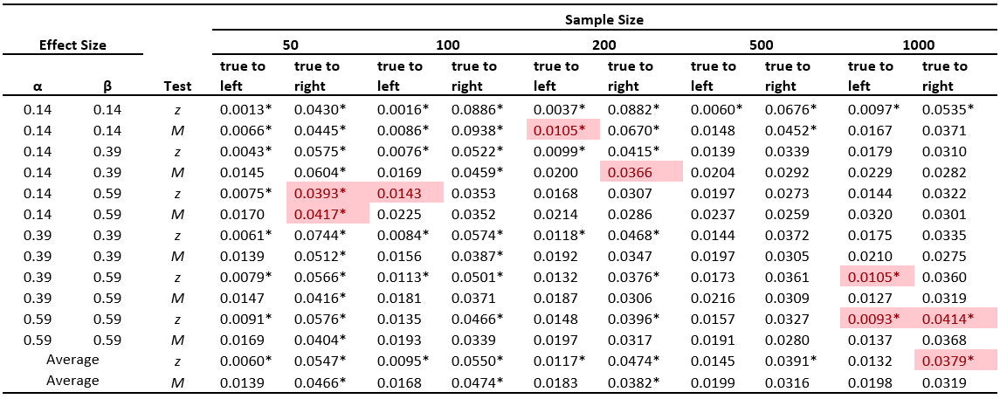
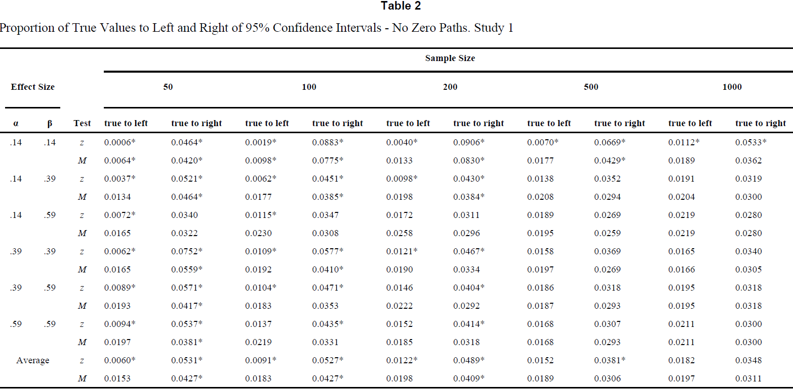
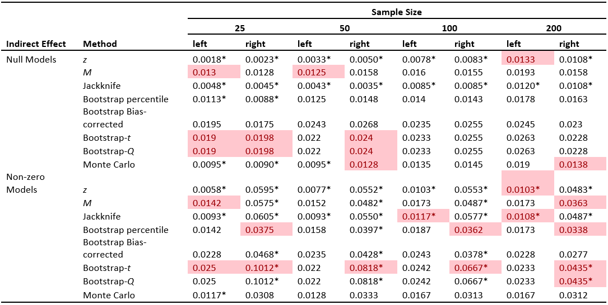
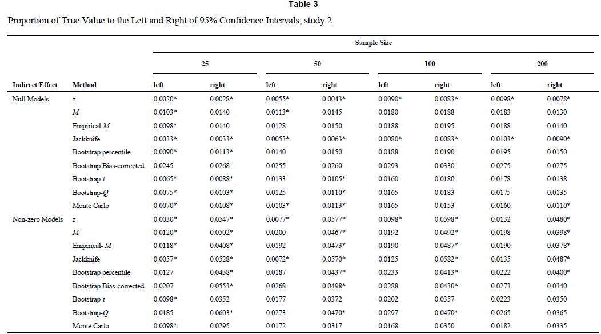
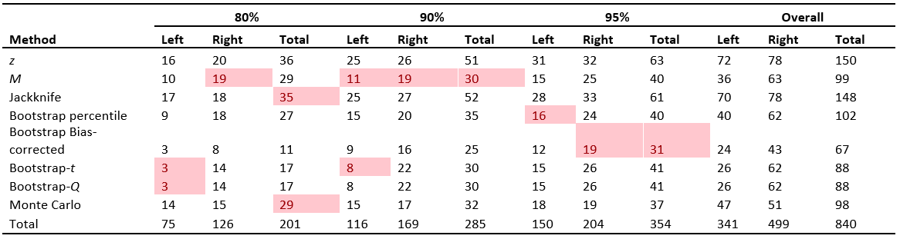
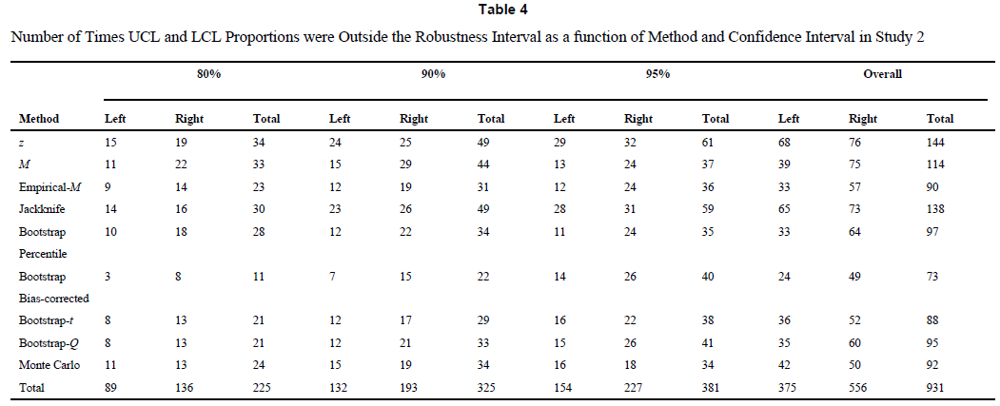
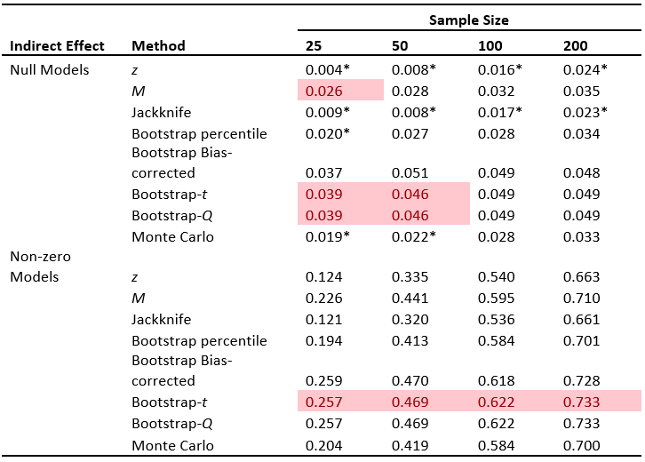
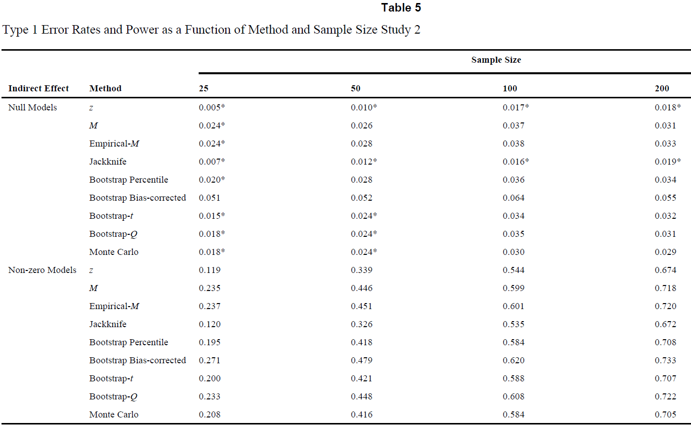

```{r setup, include = FALSE}
# packages
library(tidyverse)
library(knitr)
library(xtable)
library(RMediation)
library(rstudioapi)

# settings
knitr::opts_chunk$set(echo = FALSE, message = FALSE, warning = FALSE)
```
\urlstyle{same} <!--ensure urls have the same style as the rest of the text-->

\maketitle <!--insert title-->

\subsection*{Abstract}
We attempted to replicate two simulation studies conducted by @mackinnon04 comparing different methods of constructing confidence intervals for the indirect effect in mediation analysis. The first study compared the performance of normal theory confidence intervals to confidence intervals based on the distribution of the product of two normally distributed independent random variables. The second study compared these two confidence interval methods to resampling methods of computing confidence intervals, including the percentile bootstrap, the bias-corrected bootstrap, the jackknife, the bootstrap-$t$, the bootstrap-$Q$, and Monte Carlo confidence intervals. The overall conclusions of the original article (i.e., that the distribution of the product and resampling confidence intervals performed better than the normal theory confidence interval) were replicated in our study, but there were still many discrepancies between our results and the original results.
\vskip 2em

\noindent\makebox[\textwidth]{\large Correspondence concerning this replication report should be addressed to:}\par
\noindent\makebox[\textwidth]{\large tibbe1td@g.ucla.edu}\par

\clearpage

\section{Introduction}

This replication report documents the replication attempt of the simulation study MacKinnon, D. P., Lockwood, C. M., & Williams, J. (2004). Confidence limits for the indirect effect: Distribution of the product and resampling methods. _Multivariate Behavioral Research, 39_, 99 - 128. 
Following the definition of @rougier_sustainable_2017-1 we understand the replication of a published study as writing and running new code based on the description provided in the original publication with the aim of obtaining the same results.

\section{Method}

\subsection{Information basis}
To complete this replication attempt, we utilized information from (1) the original article by @mackinnon04, (2) additional information in a book by @manly97, and (3) an R function in a package introduced in @tofighi11.

\subsection{Data Generating Mechanism}
Information provided in the above mentioned sources indicated that the following simulation factors were systematically varied in generating the artificial data in study 1 and study 2.

| Study 1: Simulation factor | No. levels | Levels|
|-------------|---|----------------------------|
| *Varied*||  
| Confidence interval method | 2 | $z$ method, $M$ method
| Sample size | 5 | 50, 100, 200, 500, 1000
| $\alpha$ effect size | 4 | 0, .14, .39, .59
| $\beta$ effect size | 4 | 0, .14, .39, .59
| *Fixed* ||
| Direct effect size || 0
| Intercepts || 0
| *Randomly Sampled* ||
| $X$ values || sampled from $N(0,1)$
| Error terms || sampled from $N(0,1)$

| Study 2: Simulation factor | No. levels | Levels|
|-------------|---|----------------------------|
| *Varied*||  
| Confidence interval method | 9 | $z$ method, $M$ method, empirical-$M$ method, jackknife, percentile bootstrap, bias-corrected bootstrap, bootstrap-$t$, bootstrap-$Q$, Monte Carlo method
| Sample size | 4 | 25, 50, 100, 200
| $\alpha$ effect size | 4 | 0, .14, .39, .59
| $\beta$ effect size | 4 | 0, .14, .39, .59
| Confidence level | 3 | 95%, 90%, 80%
| *Fixed* ||
| Direct effect size || 0
| Intercepts || 0
| *Randomly Sampled* ||
| $X$ values || sampled from $N(0,1)$
| Error terms || sampled from $N(0,1)$


\subsubsection{Sample size}
Study 1 in the original article generated sample sizes of 50, 100, 200, 500, and 1000. For the second study, _"Because resampling methods are particularly useful when sample sizes are small, the two largest sample sizes from Study 1 were dropped and a sample size of 25 was added"_ (original article, p. 8), resulting in sample sizes of 25, 50, 100, and 200.

\subsubsection{$\alpha$ and $\beta$ effect sizes}
Both studies in the original article generated $\alpha$ and $\beta$ effect sizes of 0, .14, .39, and .59, which _"corresponded to zero, small (2% of the variance), medium (13% of the variance), and large (26% of the variance) effect sizes as described in Cohen (1988, p. 412-414)"_ (original article, p. 6). In study 1, every permutation of the $\alpha$ and $\beta$ values were multiplied together to form a total of 16 population indirect effects $\alpha \beta$. In study 2, _"to reduce the considerable computational demands of simulation studies of resampling methods"_ (original article, p. 8), only ten of these permutations were generated: $\alpha = 0$ with $\beta = 0$, $\alpha = 0$ with $\beta = .14$, $\alpha = 0$ with $\beta = .39$, $\alpha = 0$ with $\beta = .59$, $\alpha = .14$ with $\beta = .14$, $\alpha = .39$ with $\beta = .39$, $\alpha = .59$ with $\beta = .59$, $\alpha = .14$ with $\beta = .39$, $\alpha = .14$ with $\beta = .59$, and $\alpha = .39$ with $\beta = .59$.

\subsubsection{Confidence level}
In study 1, the confidence level of the confidence intervals was fixed at 95%. In study 2, the confidence level of the confidence intervals generated for the indirect effect were varied from 95%, to 90%, to 80% so that the proportion of times the true indirect effect fell to the left and the right of the confidence intervals could be calculated for different confidence levels.

\subsubsection{Repititions}
In study 1, each of the 16 indirect effects $\times$ 5 sample sizes = 80 conditions was repeated 10000 times (original article, p. 6). In study 2, each of the 10 indirect effects $\times$ 4 sample sizes = 40 conditions was repeated 1000 times. In addition, for the bootstrap methods in study 2, 1000 bootstrap samples were drawn from the generated sample in each of the 1000 iterations of each of the 40 conditions (original article, p. 8).

\subsubsection{Data Generating Process}
To generate $a$ and $b$, the sample estimates of $\alpha$ and $\beta$, sample values of $M$ and $Y$ were first generated using the equations:
$$M = i_{01} + \alpha X + \varepsilon_1$$
$$Y = i_{02} + c'X + \beta M + \varepsilon_2$$
where $X$ was the independent variable, $M$ was the mediator variable, $Y$ was the outcome variable, the $i_0$ terms were the intercepts, $c'$ was the direct effect, and the $\varepsilon$s were the error terms. The intercepts and the direct effect were set to zero, so the equations simplified to:

\begin{gather} 
M = \alpha X + \varepsilon_1 \\
Y = \beta M + \varepsilon_2  
\end{gather}  

After generating $M$ and $Y$ values, $a$ was then calculated using the following equation:
$$\mathbf{a} = (\mathbf{X_{dm}}^T \mathbf{X_{dm}})^{-1}\mathbf{X_{dm}}^T\mathbf{m}$$
where $\mathbf{a}$ is a column vector containing the ordinary least squares estimates of the intercept and $\alpha$ (i.e., $a$), $\mathbf{X_{dm}}$ is a design matrix formed by combining a column of ones and a column containing the values of $X$, and $\mathbf{m}$ is a column vector containing the values of $M$. Finally, $a$ was extracted from $\mathbf{a}$.  
  
Similarly, $b$ was calculated using the following equation:

$$\mathbf{b} = (\mathbf{M_{dm}}^T \mathbf{M_{dm}})^{-1}\mathbf{M_{dm}}^T\mathbf{y}$$
where $\mathbf{b}$ is a column vector containing the ordinary least squares estimates of the intercept, the direct effect, and $\beta$ (i.e., $b$); $\mathbf{M_{dm}}$ is a design matrix formed by combining a column of ones, a column containing the values of $X$, and a column containing the values of $M$; and $\mathbf{y}$ is a column vector containing the values of $Y$. Finally, $b$ was extracted from $\mathbf{b}$.  
  
\begin{minipage}{\linewidth}
Data generation for study 1 (and study 2) can be summarized with the following pseudo code:

\texttt{For 10000 (1000 for study 2) repetitions of each of 80 (40 for study 2) unique conditions:}
\begin{itemize}[leftmargin=*] 
	\item[--] \texttt{Sample number of $X$ values determined by sample size from standard normal distribution.}
	\item[--] \texttt{Use Equation 1 with $\varepsilon_1$ sampled from standard normal distribution to generate $M$.}
	\item[--] \texttt{Use Equation 2 with $\varepsilon_2$ sampled from standard normal distribution to generate $Y$.}
	\item[--] \texttt{Solve Equations 1 and 2 to find the ordinary least squares estimators of $\alpha$ (i.e., $a$) and $\beta$ (i.e., $b$) and estimates of their standard errors.}
\end{itemize}
\end{minipage}

\subsection{Compared Methods}
Study 1 compared two methods of generating confidence intervals for the indirect effect in simple mediation analysis. The first is the normal ($z$) method where the indirect effect is assumed to be normally distributed and a typical 95% confidence interval is calculated around the indirect effect using a z-score critical value. The second is the distribution of the product ($M$) method, which uses the distribution of the product of two independent normally distributed random variables to find critical values for a confidence interval for the indirect effect.

In addition to the $z$ and $M$ methods, study 2 compared an additional seven methods of creating confidence intervals for the indirect effect. These included an alternate distribution of the product method (referred to in the original article as the "empirical-$M$" method, p. 9), the jackknife, the percentile bootstrap, the bias-corrected bootstrap, the bootstrap-$t$, the bootstrap-$Q$, and the Monte Carlo methods of generating confidence intervals. Also in study 2, 95%, 90%, and 80% confidence intervals were formed for each method.

\subsubsection{$z$ method}
Confidence intervals were generated using the equation $ab \pm z_{1- \omega/2} \times \hat{\sigma}_{ab}$ where $ab$ is the sample indirect effect, $z_{1- \omega/2}$ is the z-score corresponding to $1- \omega/2 \times 100$ percentile of the normal distribution ($\omega$ =  alpha level determined by confidence level set), and $\hat{\sigma}_{ab}$ is the estimated standard error of the sample indirect effect calculated using the equation $\hat{\sigma}_{ab} = a^2 \hat{\sigma}^2_b + b^2 \hat{\sigma}^2_a$ (see p. 3 of original article).

\subsubsection{$M$ method}
Confidence intervals in study 1 were generated using the equations Upper Limit $=ab+\text{Meeker Upper} \times \hat{\sigma}_{ab}$ and Lower Limit $=ab+\text{Meeker Lower} \times \hat{\sigma}_{ab}$ (see p. 5 of original article). The Meeker Upper and Lower values were taken from tables in @meeker81 (see p. 5 of original article), which gave the percentiles of the distribution of the product determined by the values of $\delta_1 = a/\hat{\sigma}_a$ and $\delta_2 = b/\hat{\sigma}_b$. Because these tables only provided values of $\delta_1$ and $\delta_2$ in increments of .4, @mackinnon04 improved precision in study 2 by utilizing a FORTRAN algorithm to find percentiles for values of $\delta_1$ and $\delta_2$ in increments of .2 (see p. 9 of original article).

\subsubsection{Empirical-$M$ method}
Confidence intervals were generated using the same equations used in the $M$ method, except the Meeker Upper and Meeker Lower values were replaced with empirical values the authors simulated in case the theoretical values of the @meeker81 tables did not apply to the indirect effect (see p. 9 of original article).

\subsubsection{Jackknife}
The jackknife involves removing one observation from the dataset and then calculating the indirect effect estimate based on this new dataset containing $n-1$ observations, and then repeating this process for each observation in the original dataset until a set of $n$ indirect effect estimates each based on a dataset containing $n-1$ observations is produced. Confidence intervals were generated using the same equations used in the $z$ method, except the sample indirect effect estimate $ab$ was replaced by the average jackknife indirect effect estimate (see p. 9 of original article) and the estimated indirect effect standard error $\hat{\sigma}_{ab}$ was replaced with the jackknife estimate of the standard error (see Equation 8 on p. 9 of original article).

\subsubsection{Percentile Bootstrap}
Bootstrapping involves resampling observations with replacement from the original sample of $n$ observations to create new samples of size $n$, and then calculating the indirect effect estimate for each of these bootstrap samples. By collecting many bootstrap samples in this way, these samples form an empirical sampling distribution of the indirect effect. The percentile bootstrap confidence interval was then created using the $\omega/2 \times 100$ and $1- \omega/2 \times 100$ percentiles of this bootstrap sampling distribution as the lower and upper limits of the confidence interval. For example, a 95% confidence interval would set an alpha level of .05, and thus the $.05/2 \times 100 = 2.5$th and the $1- .05/2 \times 100 = 97.5$th percentiles of the bootstrap sampling distribution would be used for the percentile bootstrap confidence interval.

\subsubsection{Bias-Corrected Bootstrap}
The bias-corrected bootstrap confidence interval involved first creating the percentile bootstrap confidence interval and then adjusting its lower and upper limits using the process described on p. 10 of the original article.

\subsubsection{Bootstrap-$t$}
The bootstrap-$t$ confidence interval involved generating bootstrap $t$-values rather than bootstrap estimates of the indirect effect, but the exact method used to generate these $t$-values in the article was unclear and we had to infer what their procedure was for this replication attempt (see replicator degrees of freedom table below). Once the $t$-values were generated, the lower and upper limits of the bootstrap-$t$ confidence interval were found using the formulas $ab - t_{1-\omega/2} \times \hat{\sigma}_{ab}$ and $ab - t_{\omega/2} \times \hat{\sigma}_{ab}$, respectively, where $t_{1-\omega/2}$ and $t_{\omega/2}$ are the $1-\omega/2$ and $\omega/2$ percentiles of the distribution of $t$-values formed.

\subsubsection{Bootstrap-$Q$}
The bootstrap-$Q$ confidence interval involved transforming the bootstrap $t$-values calculated for the bootstrap-$t$ confidence interval using the formula $Q = t + (st^2)/3 + (s^2t^3)/27 + s/(6N)$, where $s$ is the skewness of the distribution of $t$-values and $N$ is the number of $t$-values in the distribution, 1000. The $\omega/2$ and $1-\omega/2$ percentiles of this distribution of $Q$-values were then selected and back-transformed to $t$-values using the formula $t = 3([1+s(Q - s/(6N))]^{1/3} - 1)/s$ from @manly97. The lower and upper limits of the bootstrap-$Q$ confidence interval were then found using the same formula used for the bootstrap-$t$ confidence interval. However, the formula used to calculate the skewness was not provided in the original article, and thus we had to infer what was used for this replication attempt (see replicator degrees of freedom table below). 

\subsubsection{Monte Carlo method}
The Monte Carlo method involves first taking the original sample estimates of $a$, $b$, and their standard errors $\hat{\sigma}_a$ and $\hat{\sigma}_b$, and using them as mean and standard deviation parameters to specify normal distributions for $a$ and $b$. Next, $a$ and $b$ values are randomly sampled from these normal distributions and then multiplied to form indirect effect estimates $ab$. This process is then repeated many times to produce a sampling distribution of the indirect effect. The Monte Carlo confidence interval was then formed using the same procedure used for the percentile bootstrap confidence interval, taking the $\omega/2 \times 100$ and $1- \omega/2 \times 100$ percentiles of the sampling distribution as the lower and upper limits of the confidence interval.

\subsection{Performance measures}
In study 1, the performance of the $z$ method and the $M$ method 95% confidence intervals were compared in terms of "the proportion of times the true [indirect effect] value was above the upper confidence limit and the proportion of times the true value was below the lower confidence limit" (original article, p. 6). These proportions were compared to the proportions expected under the confidence level set to determine the accuracy of the method. For example, with a 95% confidence interval, it would be expected that .025 of the true indirect effect values would fall above the upper confidence limit and .025 would fall below the lower confidence limit. The liberal robustness criterion given in @bradley78 was used to determine if each proportion was robust: If a proportion fell outside the interval $.5 \times \omega/2$ to $1.5 \times \omega/2$ (which equates to .0125 to .0375 for a 95% confidence interval), it was considered to be different from the expected proportion and thus not robust. These proportions were marked by an asterisk in their data tables.

In study 2, the performance of the $z$ method, the $M$ method, the empirical-$M$ method, the jackknife, the percentile bootstrap, the bias-corrected bootstrap, the bootstrap-$t$, the bootstrap-$Q$, and the Monte Carlo method 95%, 90%, and 80% confidence intervals were compared in terms of accuracy (defined and measured the same way it was done in study 1), type I error rate, and power. The liberal robustness criterion given in @bradley78 was used to compare type I error rates: If a type I error rate fell outside the interval $.5 \times \omega$ to $1.5 \times \omega$ (which equates to .025 to .075 for a 95% confidence interval), it was marked by an asterisk in their data tables.

\subsection{Technical implementation}
While the original simulation study was carried out in SAS, our replication was implemented
using the R programming environment (details regarding software versions can be obtained from the section Reproducibility Information). 

The following table provides an overview of replicator degrees of freedom, 
i.e. decisions that had to be made by the replicators because of insufficient or contradicting information. 
Issues were resolved by discussion among the replicators. 
Decisions were based on what the replicators perceived to be the most likely implementation with likeliness estimated by common practice and/or guideline recommendations.
Wherever feasible multiple interpretations where implemented.

| Issue | Replicator decision | Justification |
|--------------------------------|--------------------------------|--------------------------------|
| In terms of seeds used, the only information provided in the original article was that, "current time [was] used as the seed for each simulation" (pg. 6). | We set the seed to the current time on the clock when we ran each simulation: 1:19pm=119 for study 1 and 12:00pm=1200 for study 2. | We felt this was following their directions to the best of our abilities. |  
|--------------------------------|--------------------------------|--------------------------------|
No explanation of how values from @meeker81 tables were implemented for $M$ method in study 1. It was also not explained how FORTRAN algorithm was implemented in study 2. See subsection 2.6 for more information. | We used the `medci` R function from the RMediation package created by @tofighi11 to produce critical values for $M$ method in both studies 1 and 2. See subsection 2.6 for more information. | This function was created in part by MacKinnon who was first author of the original article. Also, it implements an approach developed by @meeker94, and Meeker was one of the authors of the tables used in the original article. See subsection 2.6 for more information. |
|--------------------------------|--------------------------------|--------------------------------|
No explanation of how empirical values the authors simulated were implemented for empirical-$M$ method in Study 2. See subsection 2.6 for more information. | Empirical-$M$ method was dropped from study 2, resulting in only the original $M$ method being tested. See subsection 2.6 for more information.| Since the `medci` function was the best option we could find to implement the $M$ method, and no other alternatives could be used to implement the empirical-$M$ method separately, we thought the best course of action would be to only produce results for the original $M$ method. See subsection 2.6 for more information. |
|--------------------------------|--------------------------------|--------------------------------|
It was unclear how exactly the critical values used in the bootstrap-$t$ method were found. See subsection 2.7 for more information. | A t-statistic was calculated in each bootstrap sample using the formula $(ab - \alpha \beta)/\hat{\sigma}_{ab}$. The critical values were found using the percentiles of this distribution. See subsection 2.7 for more information. | It was the most logical interpretation of the method used we could get from the original article. See subsection 2.7 for more information. |
|--------------------------------|--------------------------------|--------------------------------|
It was unclear how the skewness values used in the bootstrap-$Q$ method were found. See subsection 2.8 for more information. | We used the skewness formula provided in @manly97. See subsection 2.8 for more information. | This was the source given by @mackinnon04 for the $Q$ formula, so we felt it was logical to use the skewness formula provided there as well. See subsection 2.8 for more information. |

\subsection{Implementation of $M$ and Empirical-$M$ Methods}
\subsubsection{Issues}
In the original article, it was stated that, for the $M$ method in study 1, "The critical values are obtained from the tables in Meeker et al. (1981)..." (pg. 5). However, no further information was provided on how the values printed in these tables were implemented in the code for their simulation study, so we had no way to transfer the printed values into our own replication simulation. Similarly, to get the modified critical values used for the $M$ method in study 2, it was stated that, "These additional values were obtained with a FORTRAN algorithm written
by Alan Miller which is a minor modification of the method in Meeker and Escobar (1994) and is available at http://users.bigpond.net.au/amiller (file name: fnprod.f90)" (original article, pg. 9). Although we could not get the link to work, using the information provided we were able to find a link to the FORTRAN code at the following website: https://jblevins.org/mirror/amiller/. However, we still had no way to implement the FOTRAN algorithm in our replication simulation in R. Finally, for the empirical-$M$ method used in study 2, it was stated in a footnote that, "The empirical-M critical values are given at our website given in Footnote 1." The website given in Footnote 1 was: http://www.public.asu.edu/~davidpm/. However, we could not find the values available anywhere on the website. It appeared the site was continually updated with new publications, and the oldest publication still available was from 2012. 

\subsubsection{Solution}
After searching through previous work by the authors on the distribution of the product and reaching out to one of the authors directly still did not prove fruitful, we decided to use the `medci` R function from the RMediation package created by @tofighi11 with the `type` argument set to "dop". Under the "dop" setting, the `medci` function generates confidence limits for the indirect effect using, "an R program [Tofighi and MacKinnon] wrote to implement the distribution-of-product method using the results in Meeker and Escobar (1994)" (pg. 2 of Tofighi and MacKinnon, 2011). Since MacKinnon was first author of the original article, and the @meeker94 article was also used in the calculation of the critical values for the $M$ method in study 2 of the original article, we decided this R function was the closest we would be able to get at reproducing the original article's results for the $M$ method in both studies 1 and 2. Also, since no viable alternative to generate results for the empirical-$M$ method was available, we decided to only produce results for the original $M$ method in study 2. The `medci` function output the estimated standard error of the indirect effect and the lower and upper limits of the confidence interval directly. However, the estimated standard error it calculated was different than the estimate used by @mackinnon04. Thus, to get the critical values we wanted, we subtracted the sample indirect effect estimate $ab$ from the lower and upper limits and divided by the `medci` standard error. Then, we had the needed critical values and could calculate the lower and upper bounds using the appropriate standard error estimate.

\subsubsection{Additional Issues}
After implementing the `medci` function in our simulation, we realized there were simulated sample values of $a$ and $b$ for which the function threw an error and was not able to predict the confidence limits. Thus, we implemented a loop in our code that started an iteration of the simulation over if it produced unusable $a$ or $b$ values. The instances where `medci` failed were recorded and saved to a .csv file. In total across both simulations, the `medci` function failed in 13,264 iterations. Of those iterations, two were with a sample size of 500 and the rest were all with a sample size of 1000. The average $a$ path value when the function failed was close to what would have been expected under random selection from the conditions present in the simulation, with a mean value of .278 (and the expected value of the $\alpha$ effect size conditions was $(0+.14+.39+.59)/4=.28$). The average $b$ path value, however, was .619, indicating that the conditions in which `medci` failed to find the confidence limits occurred most often when the $b$ path was large. As will be restated later, there is a good chance this influenced some of our results.

\subsection{Implementation of Bootstrap-$t$ Method}
In the original article, it was stated that the bootstrap-$t$ method, "requires the standard error of the parameter estimate for each bootstrap sample which is the sampling standard deviation of the bootstrap sample. The value $T$ is formed for each bootstrap sample by dividing the difference between the bootstrap estimate and the original sample estimate by the bootstrap sample's standard error" (pg. 10). The standard error of the parameter and the sampling standard deviation of the bootstrap sample are not the same thing, as the former can be calculated in each bootstrap sample and the latter can only be calculated using a group of more than one bootstrap samples. Thus, in keeping with a regular $t$-statistic, we interpreted this passage to mean we were supposed to divide by $\hat{\sigma}_{ab}$, and thus we calculated our $t$-value for each bootstrap sample using the formula $(ab - \alpha \beta)/\hat{\sigma}_{ab}$.

\subsection{Calculation of Skewness for Bootstrap-$Q$ Method}
In the original article, the formulas we provided in section 2.3.8 above were given and it was stated that, "$s$ is skewness in each bootstrap distsribution of $T$, $T$ is the bootstrap-$t$ value in each individual bootstrap sample, and $N$ is the sample size (Manly, 1997)" (pg. 10). Thus, to decide how to calculate skewness in each distribution of $t$-values, we turned to the book by @manly97. The formula provided there was $s = \sum_{i=1}^N (t_i - \bar t)^3/\hat \sigma_t^3$, so this was the formula we implemented in our replication simulation.

\section{Results}

\subsection{Replication of result tables}
There were a total of five tables in the original paper that presented the results of their simulations. Tables 1 and 2 corresponded to study 1, and Tables 3 through 5 corresponded to study 2. In the following section, the tables are presented in order. For each, our replicated table is presented first followed by a screenshot of the same table from the original article.

\subsubsection{Table 1}
Table 1 (Figures 1 and 2 below) presents the proportion of true zero indirect effects that fell to the left and right of the 95% confidence intervals in Study 1. Recall that the liberal robustness criterion given in @bradley78 was used to determine if each proportion was robust: If a proportion fell outside the interval $.5 \times \omega/2$ to $1.5 \times \omega/2$ (which equates to .0125 to .0375 for a 95% confidence interval), it was considered to be different from the expected proportion and thus not robust. These proportions were marked by an asterisk in the table. The values marked in red in our replication table indicate instances where our results disagreed with the results of the original article, either indicating that a nonrobust proportion in the original article was robust or that a robust proportion in the original article was nonrobust. In total, our table disagreed with the table from the original article 10 out of 100 times. All but two of these times occurred with the $M$ method, which makes sense because that method required a large amount of replicator degrees of freedom to implement.

\newpage
\blandscape

```{r, echo=FALSE, out.width="100%", fig.cap="Study 1 proportion of true values to left and right of 95 percent confidence intervals - zero indirect effect"}

```

```{r, echo=FALSE, out.width="100%", fig.cap="Corresponding table from original article"}

```

\elandscape

\newpage

\subsubsection{Table 2}
Table 2 (Figures 3 and 4 below) presents the proportion of true nonzero indirect effects that fell to the left and right of the 95% confidence intervals in Study 1. The values marked in red in our replication table indicate instances where our results disagreed with the results of the original article, either indicating that a nonrobust proportion in the original article was robust or that a robust proportion in the original article was nonrobust. In total, our table disagreed with the table from the original article 9 out of 140 times. Interestingly, six of these nine times occurred with the $z$ method, and only three occurred with the $M$ method.

\newpage
\blandscape

```{r, echo=FALSE, out.width="100%", fig.cap="Study 1 proportion of true values to left and right of 95 percent confidence intervals - nonzero indirect effect"}

```

```{r, echo=FALSE, out.width="100%", fig.cap="Corresponding table from original article"}

```

\elandscape

\newpage

\subsubsection{Table 3}
Table 3 (Figures 5 and 6 below) presents the proportion of true zero and nonzero indirect effects that fell to the left and right of the 95% confidence intervals in Study 2. Results have been averaged across all zero indirect effects (null models) and all nonzero indirect effects (non-zero models). The values marked in red in our replication table indicate instances where our results disagreed with the results of the original article, either indicating that a nonrobust proportion in the original article was robust or that a robust proportion in the original article was nonrobust. In total, our table disagreed with the table from the original article 25 out of 128 times. Sixteen of these 25 times occurred with either the $M$ method, the bootstrap-$t$, or the bootstrap-$Q$, which makes sense since these methods required the most amount of replicator degrees of freedom to implement. Recall that the empirical-$M$ method was not calculated in our simulation (see section 2.6 above).

\newpage
\blandscape

```{r, echo=FALSE, out.width="100%", fig.cap="Study 2 proportion of true values to left and right of 95 percent confidence intervals"}

```

```{r, echo=FALSE, out.width="100%", fig.cap="Corresponding table from original article"}

```

\elandscape

\newpage

\subsubsection{Table 4}
Table 4 (Figures 7 and 8 below) presents the total number of times the proportion of true indirect effects falling to the left and right of the confidence intervals in Study 2 was outside the robustness interval determined by @bradley78. The values marked in red in our replication table indicate instances where our results disagreed with the results of the original article by my more than 2 for each method and each confidence level. In total, our table disagreed with the table from the original article by more than two 12 out of 72 times. Seven of these 12 times occurred with either the $M$ method, the bootstrap-$t$, or the bootstrap-$Q$, which makes sense since these methods required the most amount of replicator degrees of freedom to implement. Recall that the empirical-$M$ method was not calculated in our simulation (see section 2.6 above).

\newpage
\blandscape

```{r, echo=FALSE, out.width="100%", fig.cap="Study 2 number of times proportions to left and right of CIs were outside robustness criteria"}

```

```{r, echo=FALSE, out.width="100%", fig.cap="Corresponding table from original article"}

```

\elandscape

\newpage

\subsubsection{Table 5}
Table 5 (Figures 9 and 10 below) presents the type I error rates (null models section) and power (non-zero models section) of the 95% confidence intervals in Study 2. Results have been averaged across all zero indirect effects (null models) and all nonzero indirect effects (non-zero models). Recall that the liberal robustness criterion given in @bradley78 was used to compare type I error rates: If a type I error rate fell outside the interval $.5 \times \omega$ to $1.5 \times \omega$ (which equates to .025 to .075 for a 95% confidence interval), it was marked by an asterisk in the table. The values marked in red in our replication table indicate instances where our results disagreed with the results of the original article. For type I error rates, this meant a rate either had an asterisk in our table while it did not have one in the original table or it did not have one in our table while it did in the original table. For power, this meant power differed from the original article by more than .025. In total, our table disagreed with the table from the original article 9 out of 64 times. All of these 9 times occurred with either the $M$ method, the bootstrap-$t$, or the bootstrap-$Q$, which makes sense since these methods required the most amount of replicator degrees of freedom to implement. Recall that the empirical-$M$ method was not calculated in our simulation (see section 2.6 above).

\newpage
\blandscape

{width=100%}

```{r, echo=FALSE, out.width="100%", fig.cap="Corresponding table from original article"}

```

\elandscape

\newpage

\subsection{Replication of results presented in text form }
Overall, results from the text were replicated pretty well. It was claimed in the text of the original article that, in study 1, the $M$ method performed better than the $z$ method in terms of accuracy, and we saw the same thing in our replication simulation. Similarly, in study 2, the methods were grouped into four general categories based on performance: the $z$ method and jackknife performed the worst; then the percentile bootstrap, bootstrap-$t$, and Monte Carlo method performed better; then the $M$ method, empirical-$M$ method, and the bootstrap-$Q$ performed even better; and finally the bias-corrected bootstrap performed the best. These general trends were seen in our results as well, with a couple of exceptions. First, the we were not able to produce results for the empirical-$M$ method due to the reasons provided in section 2.6. Also, in our study 2, the bootstrap-$t$ and bootstrap-$Q$ performed the exact same in all conditions even though they differed in performance in the original study. This is most likely due to the replicator degrees of freedom we had to use to implement these methods (see sections 2.7 and 2.8).

\FloatBarrier
\section{Discussion}

\subsection{Replicability}
For most of the methods, replicating the simulation was not too difficult. The overall structure of the simulation was easy to get from the original article, and the simulation conditions were explicitly laid out. However, for the bootstrap-$t$, the bootstrap-$Q$, and especially the $M$ method/empirical-$M$ method, replication proved much more difficult. For the bootstrap-$t$ and bootstrap-$Q$, the @manly97 book cited in the original article had to be tracked down. For the $M$ method/empirical-$M$ method, the sources provided in the original article were dead ends, and much more independent decisions had to be made to find a way to implement them. The way we decided to go with, using the `medci` function, was undoubtedly different from the methods used in the original article, but no other feasible options were found. In total, including research needed to track down sources, around 40 hours were spent completing this replication simulation.

\subsection{Replicator degrees of freedom}
Including the code used to implement the simulation, or at least to implement the $M$ and empirical-$M$ methods, would have been immensely helpful. Without this code, it was impossible to get the tabled critical values for the $M$ methods integrated into our own simulation. Also, we found that both website links provided in the paper were either unusable or outdated and no longer provided the needed information, so making sure that all links provided are permanent and unchanging would be incredibly conducive to replication as well. Using the `medci` function undoubtedly altered our results at least somewhat. Again, as discussed in section 2.6 above, a large amount of iterations in which the estimated $b$ path was large had to be discarded since the function wouldn't run, resulting in the generated samples used in our replication simulation not truly being random.

\subsection{Equivalence of results}
With the exception of the empirical-$M$ method being excluded and the bootstrap-$Q$ performing exactly the same as the bootstrap-$t$ in study 2, our results were quite similar to the results of the original article and our recommendations for which methods to use would have been similar to the original recommendations.

\section{Acknowledgments}
The replication team would like to thank Jessica Fossum for her helpful comments on the code of our simulation.

\section{Contributions}
Authors made the following contributions according to the CRediT framework https://casrai.org/credit/

Primary Replicator: Tristan Tibbe

- Data Curation  
- Formal Analysis (lead)  
- Investigation  
- Software  
- Visualization (lead)  
- Writing - Original Draft Preparation  
- Writing - Review & Editing  

Co-Pilot: Amanda Montoya

- Formal Analysis (supporting)  
- Investigation  
- Software (supporting)  
- Visualization (supporting)  
- Validation  
- Writing - Review & Editing   

\newpage

\section*{References}
\begingroup
\hphantom{x}
\setlength{\parindent}{-0.5in}
\setlength{\leftskip}{0.5in}
<div id="refs" custom-style="Bibliography"></div>
\FloatBarrier
\endgroup
\newpage

\section*{Appendix}

\subsubsection*{Reproducibility Information}

This report was last updated on `r Sys.time()`. 
The simulation replication was conducted using the following computational environment and dependencies: 

\FloatBarrier
```{r colophon, cache = FALSE}
# which R packages and versions?
if ("devtools" %in% installed.packages()) devtools::session_info()
```

